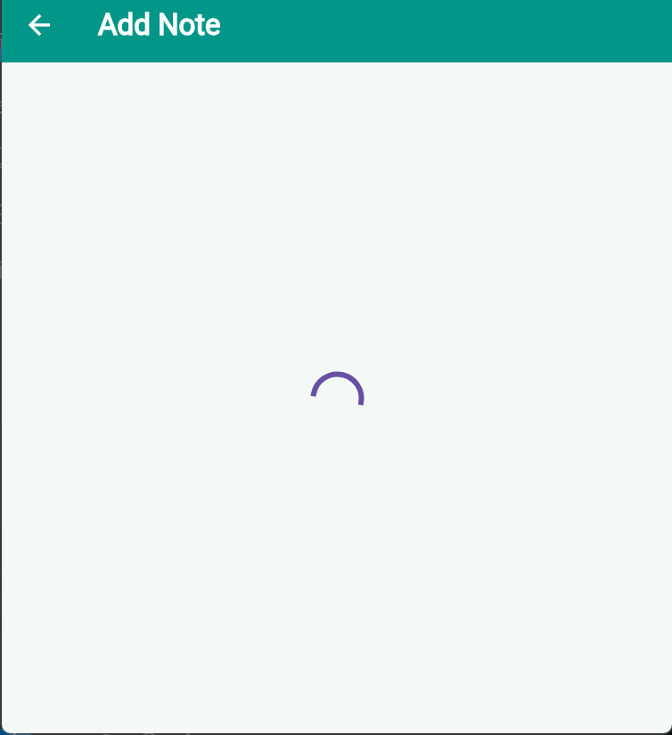
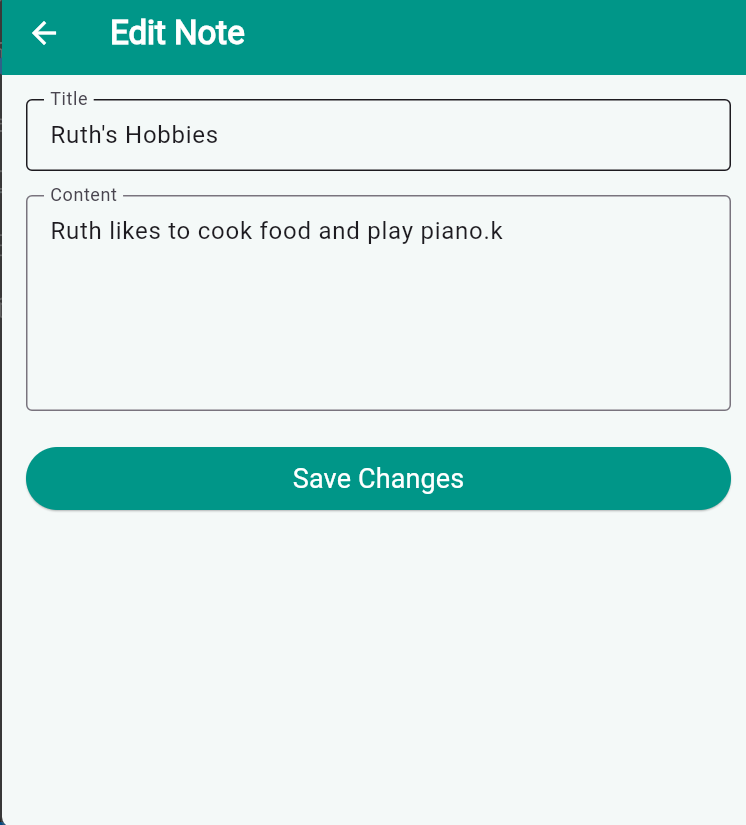
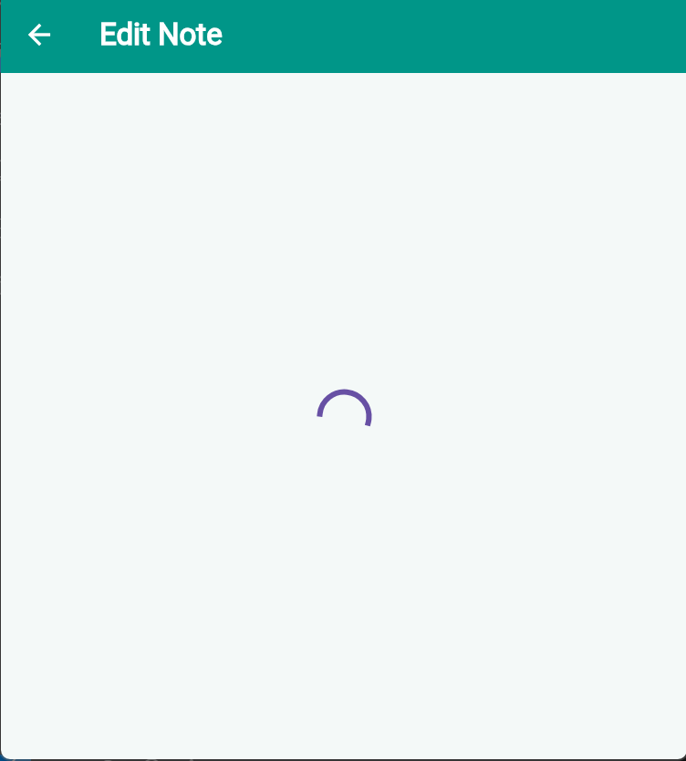
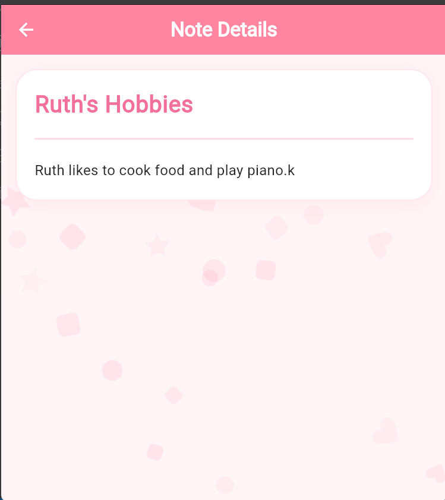

# Notes App Flutter CRUD

A Flutter CRUD application using:
- Provider
- HTTP package
- JSONPlaceholder API

### Features
- Create Notes
- Read Notes
- Update Notes
- Delete Notes
- Loading States
- Error Handling

### Screenshots

#### Notes Home Screen

#### Create Note

#### Create Loading State

#### Edit Note

#### Delete Confirmation

#### Error State

#### Initial Loading State

#### Read Note Details
