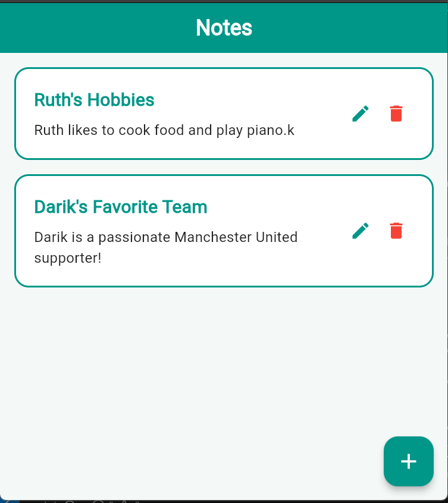
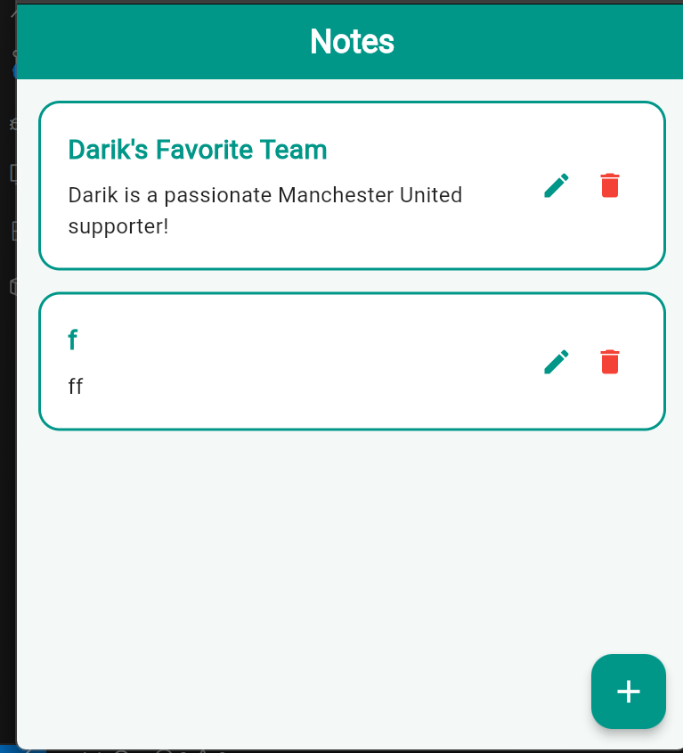
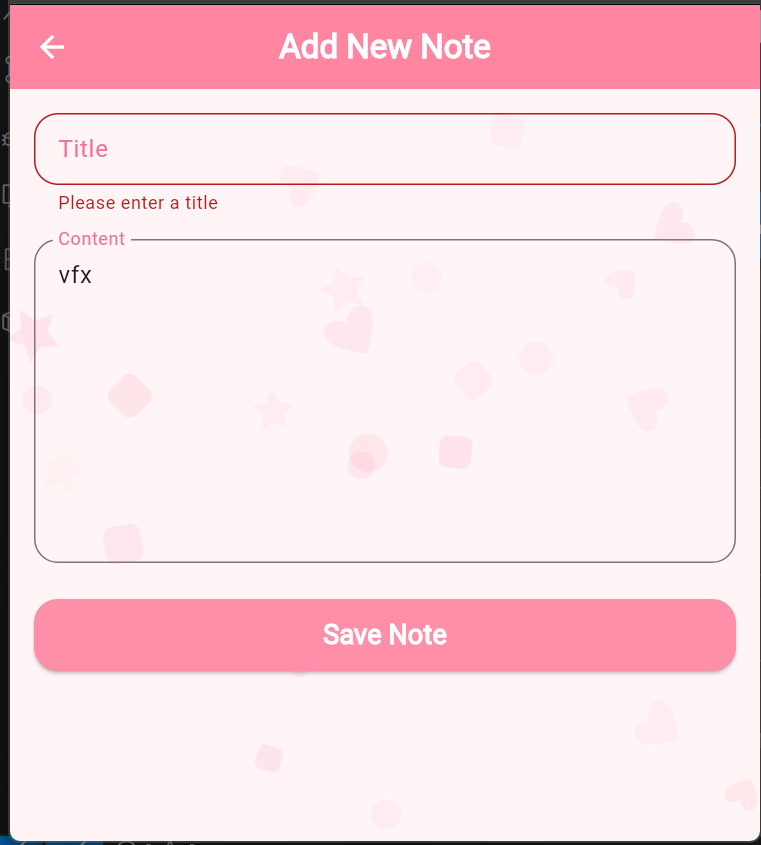
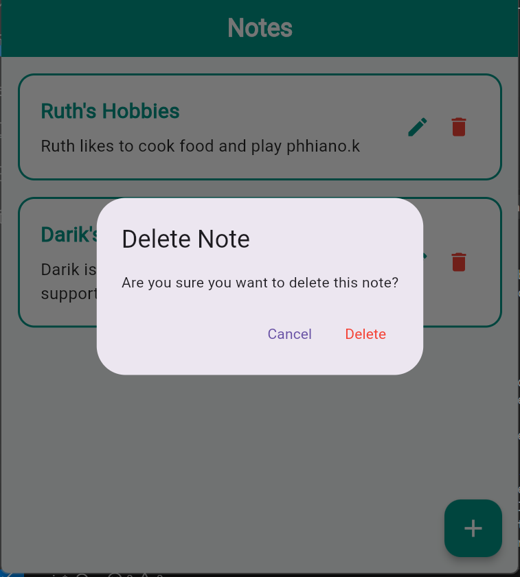

# Simple Flutter Notes App

A simple, clean, and extremely beginner-friendly **Flutter Notes App** that performs full **CRUD (Create, Read, Update, Delete)** operations. 

It connects to the public [JSONPlaceholder API](https://jsonplaceholder.typicode.com/posts) and uses the official **Provider** package for simple state management and the **http** package for standard API requests.

---

## 🌟 Features

* **Fetch Notes (Read)**: Dynamically fetches notes from the public API on startup and presents them in a beautiful, structured list of cards.
* **Add Note (Create)**: Input validation form that submits a new note to the server and adds it to the top of your list immediately.
* **Edit Note (Update)**: Modify a note's title or body with pre-filled inputs, saving the updates locally and on the server.
* **Delete Note (Delete)**: Safely request deletion via a standard confirmation dialog. The note disappears from the screen instantly upon validation.
* **Note Details**: Open any note in a dedicated details screen to view the complete title and full body content.
* **Loading & Error States**: Shows clean, circular progress spinners during actions and robust error handling screens with a "Retry" option if connection fails.

---

## 🛠️ Technologies Used

* **Flutter**: Framework for building the cross-platform application.
* **Provider**: Simple, standard State Management wrapper using `ChangeNotifier` and `notifyListeners()`.
* **http**: Lightweight and powerful official Dart package for REST API communication.
* **JSONPlaceholder API**: Public REST API for simulating fake blog posts as notes (`/posts`).

---

## 📂 Folder Structure

The project strictly follows a simple, clean folder architecture that is incredibly easy to understand:

```text
lib/
│
├── models/         # Holds data representation classes
│   └── note.dart   # Note class, parses API JSON and serializes map data
│
├── services/       # Manages external data requests
│   └── api_service.dart # Pure HTTP calls for GET, POST, PUT, DELETE requests
│
├── providers/      # Handles state management and local data mutation
│   └── note_provider.dart # Single app state controller using ChangeNotifier
│
├── widgets/        # Contains reusable UI design blocks
│   └── note_card.dart # Reusable Material card with Edit & Delete action buttons
│
├── screens/        # Pages that occupy the viewport
│   ├── home_screen.dart        # Main UI showing the lists, FAB, and loaders
│   ├── add_note_screen.dart    # Simple validation form for inserting a note
│   ├── edit_note_screen.dart   # Simple validation form for modifying a note
│   └── note_detail_screen.dart # Screen showing full note title & content
│
└── main.dart       # App startup configuration and provider initialization
```

### Folder Explanation:
* **models** $\rightarrow$ Note data class that translates server-side JSON to standard Dart variables.
* **providers** $\rightarrow$ App state management containing loading states, error states, and local lists. Uses `notifyListeners()` to rebuild the UI instantly.
* **services** $\rightarrow$ Simple HTTP client requests mapping standard CRUD paths.
* **screens** $\rightarrow$ Complete view pages that users navigate between.
* **widgets** $\rightarrow$ Clean, reusable component UI widgets.
* **main.dart** $\rightarrow$ App entry point that registers the Provider state scope.

---

## 🚀 How to Run the App

Ensure you have [Flutter SDK](https://docs.flutter.dev/get-started/install) installed on your system.

1. **Clone or navigate** to the project directory:
   ```bash
   cd notes
   ```

2. **Fetch dependencies**:
   ```bash
   flutter pub get
   ```

3. **Run the application**:
   ```bash
   flutter run
   ```

---

## 📸 App Screenshots

Below is the user flow and screens captured directly from the live application:

### 1. Notes Home Screen (Read)
Displays the fetched posts list in clean Material card layouts.


### 2. Create Note Screen (Create)
Simple input fields with validation before submitting.


### Error State


### 4. Delete Dialog (Delete)
A secure confirm-action popup before deleting notes instantly.


### 5. Error & Retry State
Gracefully handles offline states or network issues, including a manual Retry option.
